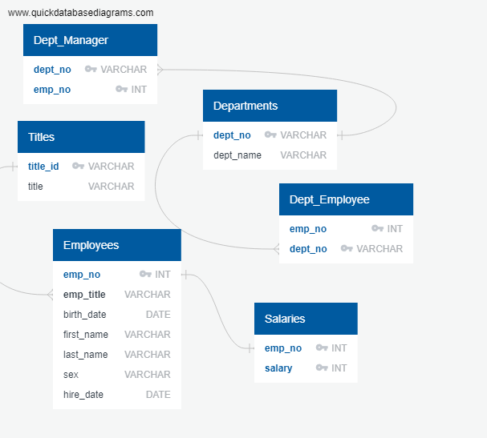

# sql-challenge
## GA Tech Data Science and Analytics Boot Camp Module 9
### Description: Employee Database

For this module, we explore data modeling, data engineering, and data analysis techniques using PostGreSQL in the pgAdmin application and <a href="https://www.quickdatabasediagrams.com/">QuickDBD</a> for data modeling.
 

We are given 6 CVS files that we import into our local database after creating the ERD in QuickDBD, as shown below.

After building the schemata, we create our databases. The schemata can be viewed <a href="QuickDBD-EmployeeSchema_export.sql">here</a>.

In order to prevent any primary keys and foreign keys related errors, the tables were created and imported with data in the following order:

1. Titles
2. Employees
3. Departments
4. Department Managers
5. Department Employees
6. Salaries

Once the data was loaded in, the following queries were written:

1. <b>List the following details of each employee: employee number, last name, first name, sex, and salary.</b>

This query performs an INNER JOIN on Employees and Salaries in order to list out the corresponding salary for each employee in the Employee table.

2. <b>List first name, last name, and hire date for employees who were hired in 1986.</b>

This query utilizes the WHERE clause along with DATE_PART to be able to extract out the year of the date value to 1986.

3. <b>List the manager of each department with the following information: department number, department name, the manager's employee number, last name, first name.</b>

This query performs an INNER JOIN between Dept_Manager, Employees, and Departments tables to find the corresponding department number and name for each department manager employee.
 

4. <b>List the department of each employee with the following information: employee number, last name, first name, and department name.</b>

This query performs an INNER JOIN between Employees, Dept_Employee, and Departments tables to find the corresponding department name for each employee

5. <b>List first name, last name, and sex for employees whose first name is "Hercules" and last names begin with "B."</b>

This query utilizes the WHERE clause to identify employees that have the first name "Hercules". Last name starting with "B" is found using the pattern matching technique with wildcard characters. This can be written like this: "B%", where it will return any string that starts with the character "B".

6. <b>List all employees in the Sales department, including their employee number, last name, first name, and department name.</b>

This query performs an INNER JOIN between Employees, Dept_Employee, and Departments tables, as well as the WHERE claus to find employees in the sales department

7. <b>List all employees in the Sales and Development departments, including their employee number, last name, first name, and department name.</b>

 This query is similar to #6, but in addition to the WHERE clause filtering for employees in the sales department, it also has a condition to include any employees that are from the development department.

8. <b>List the frequency count of employee last names (i.e., how many employees share each last name) in descending order.</b>

This query utilizes the GROUP BY and COUNT clause to identify the unique last names and the count of each last name. Then it uses ORDER BY clause to group the list in descending order.

### Submission Requirements
* Image file of ERD, found <a href="EmployeeSQL/QuickDBD-Employee_export.png">here</a>.
* SQL file of table schemata, found <a href="QuickDBD-EmployeeSchema_export.sql">here</a>.
* SQL file of data analysis queries, found <a href="EmployeeSQL/employee_queries.sql">here</a>
